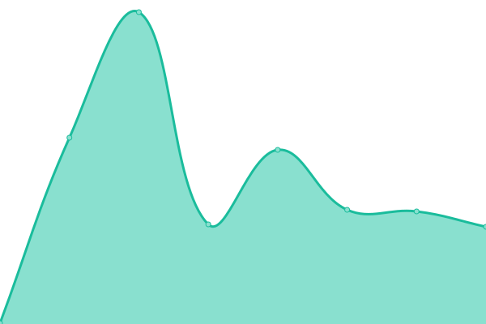

# [📈 Live Status](https://status.oleglucic.com): <!--live status--> **🟧 Partial outage**

This repository contains the open-source uptime monitor and status page for [Oleg lučić](https://status.oleglucic.com), powered by [Upptime](https://github.com/upptime/upptime).

With [Upptime](https://upptime.js.org), you can get your own unlimited and free uptime monitor and status page, powered entirely by a GitHub repository. We use [Issues](https://github.com/oleglucic/upptime/issues) as incident reports, [Actions](https://github.com/oleglucic/upptime/actions) as uptime monitors, and [Pages](https://status.oleglucic.com) for the status page.

<!--start: status pages-->
<!-- This summary is generated by Upptime (https://github.com/upptime/upptime) -->
<!-- Do not edit this manually, your changes will be overwritten -->
<!-- prettier-ignore -->
| URL | Status | History | Response Time | Uptime |
| --- | ------ | ------- | ------------- | ------ |
|  AIOStreams | 🟥 Down | [aio-streams.yml](https://github.com/oleglucic/upptime/commits/HEAD/history/aio-streams.yml) | 

 144ms
     
 | 

<a href="https://status.oleglucic.com/history/aio-streams">0.00%</a>
    

|  Cloud | 🟥 Down | [cloud.yml](https://github.com/oleglucic/upptime/commits/HEAD/history/cloud.yml) | 

 145ms
     
 | 

<a href="https://status.oleglucic.com/history/cloud">0.00%</a>
    

|  Dashboard | 🟥 Down | [dashboard.yml](https://github.com/oleglucic/upptime/commits/HEAD/history/dashboard.yml) | 

 125ms
     
 | 

<a href="https://status.oleglucic.com/history/dashboard">2.77%</a>
    

|  Deca za Siguran Net | 🟩 Up | [deca-za-siguran-net.yml](https://github.com/oleglucic/upptime/commits/HEAD/history/deca-za-siguran-net.yml) | 

 613ms
     
 | 

<a href="https://status.oleglucic.com/history/deca-za-siguran-net">100.00%</a>
    

|  Portainer | 🟥 Down | [portainer.yml](https://github.com/oleglucic/upptime/commits/HEAD/history/portainer.yml) | 

 149ms
     
 | 

<a href="https://status.oleglucic.com/history/portainer">3.32%</a>
    

|  [IPv6 test](forwardemail.net) | 🟥 Down | [i-pv6-test.yml](https://github.com/oleglucic/upptime/commits/HEAD/history/i-pv6-test.yml) | 

 0ms
     
 | 

<a href="https://status.oleglucic.com/history/i-pv6-test">100.00%</a>
    

<!--end: status pages-->

[**Visit our status website →**](https://status.oleglucic.com)

## 📄 License

- Powered by: [Upptime](https://github.com/upptime/upptime)
- Code: [MIT](./LICENSE) © [Anand Chowdhary](https://anandchowdhary.com), supported by [Pabio](https://pabio.com)
- Data in the `./history` directory: [Open Database License](https://opendatacommons.org/licenses/odbl/1-0/)
